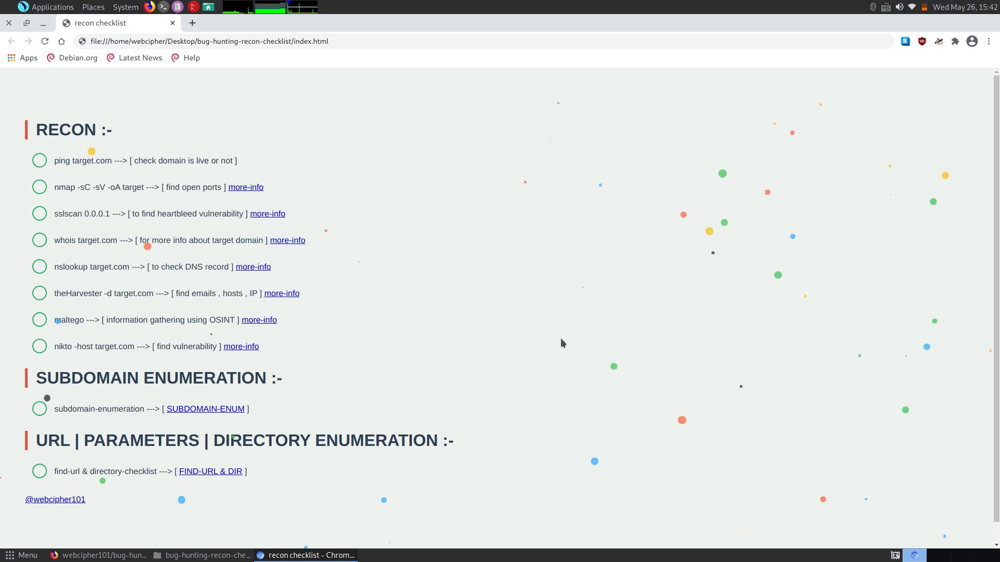

# Intro

A simple and easy to understand html+css+bash script for recon :)

>>> by : webcipher101
>>> recon-checklist for bug hunting

>>> if you have any issue about tool dm me on twitter :- <a href="https://twitter.com/webcipher101?s=09">link</a>

>>> checkout my recon-map to automate your recon task :- <a href="https://">link</a>

# bug-hunting-recon-checklist by webcipher
<a href="https://twitter.com/webcipher101?s=09">@webcipher101</a>

easy to use and understand (bigginers friendly)

# Usage

>> in terminal :-

>> git clone https://github.com/webcipher101/bug-hunting-recon-checklist.git

>> cd bug-hunting-recon-checklist
 
>> chmod +x start-checklist.sh

>> ./start-checklist.sh

>> in browser :-
append your browser screen in full size.

happy hunting..!

<a href="https://twitter.com/webcipher101?s=09">@webcipher101</a>
